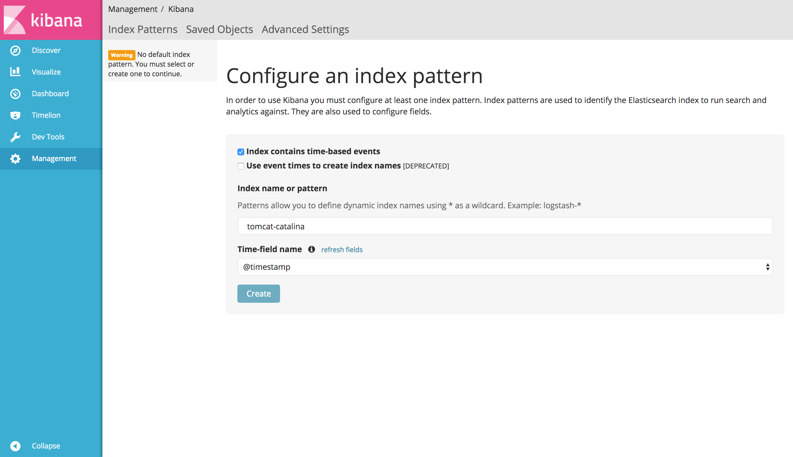
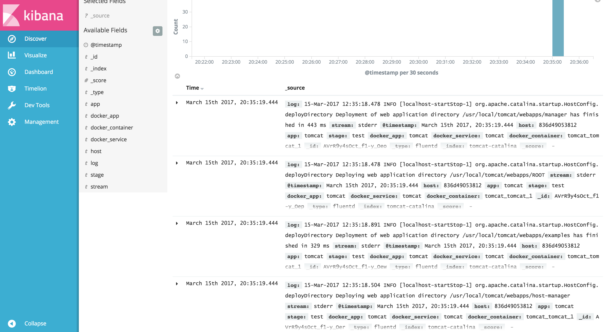

log-pilot
=========

[](https://circleci.com/gh/AliyunContainerService/log-pilot)
[](https://goreportcard.com/report/github.com/AliyunContainerService/log-pilot)

`log-pilot` is an awesome docker log tool. With `log-pilot` you can collect logs from docker hosts and send them to your centralized log system such as elasticsearch, graylog2, awsog and etc. `log-pilot` can collect not only docker stdout but also log file that inside docker containers.

Try it
======

Prerequisites:

- docker-compose >= 1.6
- Docker Engine >= 1.10

```
# download log-pilot project
git clone git@github.com:AliyunContainerService/log-pilot.git
# build log-pilot image
cd log-pilot/ && ./build-image.sh
# quick start
cd quickstart/ && ./run
```

Then access kibana under the tips. You will find that tomcat's has been collected and sended to kibana.

Create index:


Query the logs:


Quickstart
==========

### Run pilot

```
docker run --rm -it \
    -v /var/run/docker.sock:/var/run/docker.sock \
    -v /etc/localtime:/etc/localtime \
    -v /:/host:ro \
    --cap-add SYS_ADMIN \
    registry.cn-hangzhou.aliyuncs.com/acs/log-pilot:0.9.5-filebeat
```

### Run applications whose logs need to be collected

Open a new terminal, run the application. With tomcat for example:

```
docker run -it --rm  -p 10080:8080 \
    -v /usr/local/tomcat/logs \
    --label aliyun.logs.catalina=stdout \
    --label aliyun.logs.access=/usr/local/tomcat/logs/localhost_access_log.*.txt \
    tomcat
```

Now watch the output of log-pilot. You will find that log-pilot get all tomcat's startup logs. If you access tomcat with your broswer, access logs in `/usr/local/tomcat/logs/localhost_access_log.\*.txt` will also be displayed in log-pilot's output.

More Info: [Fluentd Plugin](docs/fluentd/docs.md) and [Filebeat Plugin](docs/filebeat/docs.md)

Feature
========

- Support both [fluentd plugin](docs/fluentd/docs.md) and [filebeat plugin](docs/filebeat/docs.md). You don't need to create new fluentd or filebeat process for every docker container.
- Support both stdout and log files. Either docker log driver or logspout can only collect stdout.
- Declarative configuration. You need do nothing but declare the logs you want to collect.
- Support many log management: elastichsearch, graylog2, awslogs and more.
- Tags. You could add tags on the logs collected, and later filter by tags in log management.

Build log-pilot
===================

Prerequisites:

- Go >= 1.6

```
go get github.com/AliyunContainerService/log-pilot
cd $GOPATH/github.com/AliyunContainerService/log-pilot
# This will create a new docker image named log-pilot:latest
./build-image.sh
```

Contribute
==========

You are welcome to make new issues and pull reuqests.

