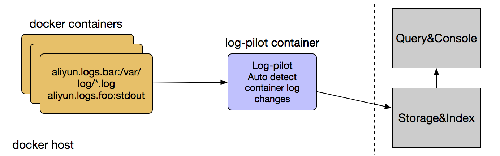

Architecture
============

On every docker host, run a log-pilot instance. Log-pilot will monitor docker events, and parse log labels on new docker conatainer, and generate appropriate log configuration and notify fluentd or filebeat process to reload the new configuration.



Run Log-pilot With Filebeat Plugin
=================================

You must set environment variable ```PILOT_TYPE=filebeat``` to enable filebeat plugin within log-pilot.

### Start log-pilot in docker container

```
docker run --rm -it \
   -v /var/run/docker.sock:/var/run/docker.sock \
   -v /etc/localtime:/etc/localtime \
   -v /:/host:ro \
   --cap-add SYS_ADMIN \
   registry.cn-hangzhou.aliyuncs.com/acs/log-pilot:0.9.5-filebeat
```

By default, all the logs that log-pilot collect will write to log-pilot's stdout. 

### Work with elastichsearch

The command below run pilot with elastichsearch output, this makes log-pilot send all logs to elastichsearch.

```
docker run --rm -it \
    -v /var/run/docker.sock:/var/run/docker.sock \
    -v /etc/localtime:/etc/localtime \
    -v /:/host:ro \
    --cap-add SYS_ADMIN \
    -e LOGGING_OUTPUT=elasticsearch \
    -e ELASTICSEARCH_HOST=${ELASTICSEARCH_HOST} \
    -e ELASTICSEARCH_PORT=${ELASTICSEARCH_PORT} \
    registry.cn-hangzhou.aliyuncs.com/acs/log-pilot:0.9.5-filebeat
```

Log output plugin configuration
===============================

You can config the environment variable ```LOGGING_OUTPUT ``` to determine which log management will be output.

### Supported log management

- elasticsearch

```
ELASTICSEARCH_HOST       "(required) elasticsearch host"
ELASTICSEARCH_PORT       "(required) elasticsearch port"
ELASTICSEARCH_USER       "(optinal) elasticsearch authentication username"
ELASTICSEARCH_PASSWORD   "(optinal) elasticsearch authentication password"
ELASTICSEARCH_PATH       "(optinal) elasticsearch http path prefix"
ELASTICSEARCH_SCHEME     "(optinal) elasticsearch scheme, default is http"
```

- logstash

```
LOGSTASH_HOST            "(required) logstash host"
LOGSTASH_PORT            "(required) logstash port"
```

- file

```
FILE_PATH             "(required) output log file directory"
FILE_NAME             "(optinal) the name of the generated files, default is filebeat"
FILE_ROTATE_SIZE      "(optinal) the maximum size in kilobytes of each file. When this size is reached, the files are rotated. The default value is 10240 KB"
FILE_NUMBER_OF_FILES  "(optinal) the maximum number of files to save under path. When this number of files is reached, the oldest file is deleted, and the rest of the files are shifted from last to first. The default is 7 files"
FILE_PERMISSIONS      "(optinal) permissions to use for file creation, default is 0600"
```

- redis

```
REDIS_HOST      "(required) redis host"
REDIS_PORT      "(required) redis port"
REDIS_PASSWORD  "(optinal) redis authentication password"
REDIS_DATATYPE  "(optinal) redis data type to use for publishing events"
REDIS_TIMEOUT   "(optinal) redis connection timeout in seconds, default is 5"
```

- kafka

```
KAFKA_BROKERS         "(required) kafka brokers"
KAFKA_VERSION         "(optinal) kafka version"
KAFKA_USERNAME        "(optianl) kafka username"
KAFKA_PASSWORD        "(optianl) kafka password"
KAFKA_PARTITION_KEY   "(optinal) kafka partition key"
KAFKA_PARTITION       "(optinal) kafka partition strategy"
KAFKA_CLIENT_ID       "(optinal) the configurable ClientID used for logging, debugging, and auditing purposes. The default is beats"
KAFKA_BROKER_TIMEOUT  "(optinal) the number of seconds to wait for responses from the Kafka brokers before timing out. The default is 30 (seconds)."
KAFKA_KEEP_ALIVE      "(optinal) keep-alive period for an active network connection. If 0s, keep-alives are disabled, default is 0 seconds"
KAFKA_REQUIRE_ACKS    "(optinal) ACK reliability level required from broker. 0=no response, 1=wait for local commit, -1=wait for all replicas to commit. The default is 1"
```

### Other log management

Supports for other log managements are in progress. You are welcome to create a pull request.

Declare log configuration of docker container
=============================================

### Basic usage

```
docker run -it --rm  -p 10080:8080 \
    -v /usr/local/tomcat/logs \
    --label aliyun.logs.catalina=stdout \
    --label aliyun.logs.access=/usr/local/tomcat/logs/localhost_access_log.*.txt \
    tomcat
```

The command above runs tomcat container, expect that log-pilot collect stdout of tomcat and logs in `/usr/local/tomcat/logs/localhost_access_log.\*.txt`. `-v /usr/local/tomcat/logs` is needed here so fluentd-pilot could access file in tomcat container.

### More

There are many labels you can use to describe the log info. 

- `aliyun.logs.$name=$path`
    - Name is an identify, can be any string you want. The valid characters in name are `0-9a-zA-Z_-`
    - Path is the log file path, can contains wildcard. `stdout` is a special value which means stdout of the container.
- `aliyun.logs.$name.tags="k1=v1,k2=v2"`: tags will be appended to log. 
- `aliyun.logs.$name.target=target-for-log-storage`: target is used by the output plugins, instruct the plugins to store
logs in appropriate place. For elasticsearch output, target means the log index in elasticsearch. For aliyun_sls output,
target means the logstore in aliyun sls. The default value of target is the log name.
